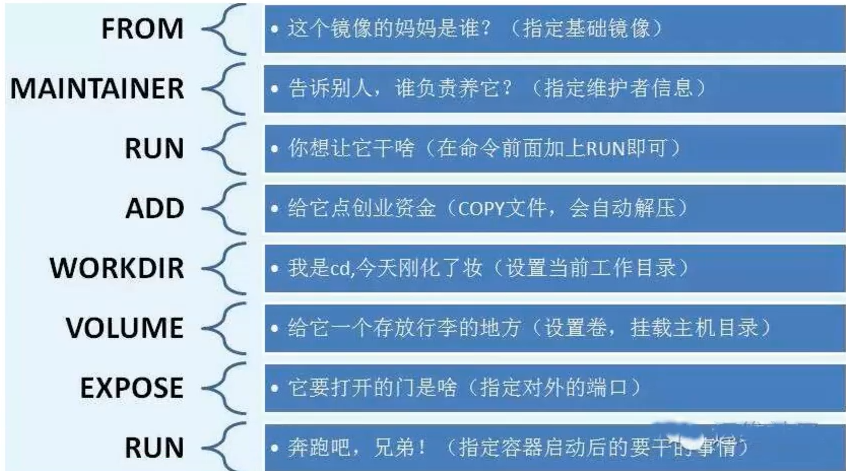

# Docker 常用命令

##### CentOS7安装Docker

```shell
# 1.卸载旧版本
sudo yum remove docker \
                  docker-client \
                  docker-client-latest \
                  docker-common \
                  docker-latest \
                  docker-latest-logrotate \
                  docker-logrotate \
                  docker-engine
# 2.需要的安装包
sudo yum install -y yum-utils
# 3.设置镜像仓库 
sudo yum-config-manager \
    --add-repo \
    http://mirrors.aliyun.com/docker-ce/linux/centos/docker-ce.repo
# 4.安装docker
sudo yum install docker-ce docker-ce-cli containerd.io

########################1-4 == yum install -y docker ##########################


# 5.启动（停止/查看状态）docker    
systemctl start/stop/status docker
# 6.查看版本 
docker version


# 7.配置阿里云私有镜像
sudo mkdir -p /etc/docker
sudo tee /etc/docker/daemon.json <<-'EOF'
{
  "registry-mirrors": ["https://ow3lach2.mirror.aliyuncs.com"]
}
EOF
sudo systemctl daemon-reload
sudo systemctl restart docker
```

##### 一、基础命令

###### 1.1查看版本 

```
docker -v
```

###### 1.2查看信息 

```
docker info
```

###### 1.3启动 

```
systemctl start docker
```

###### 1.4停止 

```
systemctl stop docker
```

###### 1.5查看状态 

```
systemctl status docker
```

##### 二、镜像相关命令

###### 2.1 查看所有镜像

```
docker images
```

###### 2.2 搜索镜像

```shell
# 直接搜索镜像名
docker search imageName 

docker serach mysql
```

###### 2.3 拉取镜像

```shell
# 默认拉取最后一个版本
docker pull imageName 
# 拉取制定版本镜像
docker pull imageName:version  
```

###### 2.4 删除镜像

```shell
# 根据镜像id删除镜像
docker rmi imageId 
# 删除所有镜像
docker rmi `docker images -q` / docker rmi $(docker images -q)
```

##### 三、容器相关命令

###### 3.1.1 查看容器

```shell
# 查看正在运行的容器
docker ps

# 查看所有容器
docker ps -a

# 查看最后一次运行的容器
docker ps -1

# 查看停止运行的容器
docker ps  -f status=exited  
```

###### 3.1.2 创建与启动容器

创建容器常用的参数说明

创建容器命令

```shell
docker run
```

`-i`:表示运行容器

`-t`:表示容器启动后会进入其命令行，加入这两个参数后，容器创建就能登录进去，既分配一个伪终端

`--name`:为创建的容器命名

`-v`:表示目录映射关系（前者是宿主机目录，后者是映射到宿主机上的目录）

`-d`:表示创建一个守护式容器后台运行，不会自动登录容器，-i -t创建后会进入容器

`-p`:表示映射端口，前者是宿主机端口，后者是容器内的映射端口。可以使用-p做多个端口映射

 1. 交互式创建容器

    ```shell
    # 交互式创建容器		
    docker run -it --name=容器名称 镜像名称:标签 /bin/bash
    docker run -it --name=myCentos centos:7 /bin/bash
    ```
```
    
这时我们通过ps命令查看，发现可以看到启动的容器，状态为启动状态
    
退出当前容器
    
    `exit`  退出后容器停止运行
    
    进入正在运行的容器
    
    ```shell
    # 进入正在运行的容器
    docker attach 容器id
```

 2. 守护方式创建容器

    使用 -d  则在后台运行 ，守护式在后台运行，所以不需要/bin/bash

    ```
    docker run -id --name=容器名称 镜像名称:标签
    docker run -id --name=myCentos2 centos:7   注意容器不能重名
    ```

    进入守护式的容器

    ```
    docker exec -it  id/name /bin/bash
    docker exec -it  myCentos2 /bin/bash
    docker exec -it  7f022ad69698 /bin/bash
    ```

    守护方式创建的容器，使用exit退出之后，容器依旧运行，不会停止

 3. 停止后台运行的容器

    ```shell
    docker stop  容器id/容器name
    docker stop myCentos2       docker stop 7f022ad69698
    ```

 4. 启动停止掉的容器

    ```shell
    docker start  容器id/容器name
    docker start myCentos2       docker start 7f022ad69698
    ```
    
 5. 查看容器

    ```shell
    docker ps  查看正在运行的容器
    docker ps -a 查看所有容器（正在运行的以及曾经运行过的）
    docker ps -q 只显示容器id
    docker ps -aq 查看所有容器的id列表
    ```

 6. 删除容器

    ```shell
    docker rm container_id/name 删除单个容器
    docker rm $(docker ps -aq) 删除所有容器  把docker ps -aq的结果作为rm的参数，递归删除所有容器
    ```

    

##### 四、其他命令

###### 查看日志

```shell
# 显示从某个时间开始的日志
docker logs --since "2021-02-15"  a982e5d096fc
# 显示最新十条日志
docker logs --tail 10 a982e5d096fc    

```

###### 查看容器中的进程信息

```shell
docker top container_id/name
```

###### 查看容器详细信息

```shell
docker inspect container_id/name
```

查看容器所占用的系统资源

```shell
docker stats container_id/name


CONTAINER           CPU %               MEM USAGE / LIMIT       MEM %               NET I/O             BLOCK I/O           PIDS
6901                0.14%               1.236 GiB / 3.562 GiB   34.70%              0 B / 648 B         0 B / 696 kB        42
```


##### 五、宿主机和容器拷贝文件

######  1.宿主机到容器

```shell
docker cp fileName   容器id/name:/path/path
docker cp file.txt  myCentos2:/usr/tmp
```

###### 2.容器到宿主机

```shell
docker cp 容器id/name:/path/path/fileName     宿主机/path/fileNewName
docker cp myCentos2:/usr/tmp/file.txt         mytmp/fileCopy.txt
```

##### 六、可视化

- portainer

> ```shell
> docker run -d -p 9000:9000 \
> 
>  --restart=always \
>  -v /var/run/docker.sock:/var/run/docker.sock \
>  --name prtainer-test \
>  docker.io/portainer/portainer
> ```

- Rancher(CI/CD)


##### 七、镜像

- 从远程仓库下载
- 从其他地方拷贝
- 自己制作一个镜像

commit镜像：把现有的容器 打包成新的镜像

```shell
docker commit 	-m='注释'	 -a='作者信息'   	 container_id/name   镜像名:tag
docker commit 	-a='zsk'  -m='add webapss' 	 tomcart01 			tomcat:my1.0
```

##### 八、容器数据卷

将Docker中生产的数据同步到本地

将Docker中的目录挂载到Linux上面

总结：容器的持久化与同步操作

###### 使用数据卷

```shell
# -v  宿主机路径:容器内路径  
docker run -id --name centos1 -v /root/ceshi:/usr/tmp:rw centos
# ro/rw  readonly/readwrite 一旦ro,挂载的目录只能从宿主机修改，而容器无权限修改；默认不写的情况下是rw
```

挂载成功后，挂载的目录在宿主机中的操作和在容器中的操作同步，容器关闭后对宿主机的该目录进行修改，容器启动后数据也会同步

###### 数据卷容器

```shell
# 可以实现容器之间共享同一份数据,不用再写-v
--volumes-from 父容器
```


##### 九、Dockerfile

###### 用来构建Docker镜像的构建文件

- 编写一个Dockerfile文件
- docker build 构建成为一个镜像
- docker run 运行镜像
- docker push 发布镜像(DockerHub,阿里云)

###### 基础知识

- 每个关键字大写
- 从上到下依次执行
- #用于注释
- 每一个指令都会创建提交一个新的 镜像层并提交




```shell
FROM  		# 基础镜像，一切从这里 开始构建 centos
MAINTAINER 	# 镜像是是写的  姓名+有效
RUN 		# 镜像侯建的时候需要运行的命令
ADD			# 步骤：tomcat镜像
WORKDIR		# 镜像的工作目录
VOLUME		# 挂载的目录
EXPOSE		# 暴露端口配置，在这里配置了启动的时候就不必再指定-p配置
CMD			# 指定这个容器启动的时候要执行的命令，只有最后一个cmd命令会生效，可被替代
ENTRYPOINT	# 指定这个容器启动的时候要执行的命令，每个都生效，追加执行
COPY		# 类似ADD，将我们的文件拷贝到镜像中
ENV			# 构建的时候设置环境变量
```

###### 实战测试

```shell
# 创建一个自己的centos  
FROM centos #从官方精简版的centos开始
MAINTAINER zsk<172585456@qq.com>
ENV MYPATH /usr/local
WORK

```


##### 十、Docker网络

##### 十一、部署相关

###### 	1.RabbitMQ

```
	//拉取镜像
	docker pull rabbitmq:management
	
	//守护式启动并映射端口
	docker run -id --name=rabbitmq -p 5671:5671 -p 5672:5672 -p 4369:4369 -p 25672:25672 	 -p 15671:15671 	-p 15672:15672 rabbitmq
	
	② docker run -d --hostname my-rabbit --name rabbit -p 15672:15672 -p 5672:5672 rabbitmq:management
	
	//进入rabbitmq容器
	docker exec -it rabbitmq /bin/bash 
	
	// 启动UI插件
	rabbitmq-plugins enable rabbitmq_management
	
```

######  2.MySQL