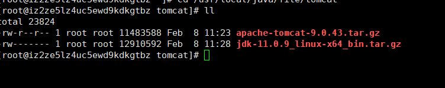

# Docker 常用命令

##### CentOS7安装Docker

```shell
# 1.卸载旧版本
sudo yum remove docker \
                  docker-client \
                  docker-client-latest \
                  docker-common \
                  docker-latest \
                  docker-latest-logrotate \
                  docker-logrotate \
                  docker-engine
# 2.需要的安装包
sudo yum install -y yum-utils
# 3.设置镜像仓库 
sudo yum-config-manager \
    --add-repo \
    http://mirrors.aliyun.com/docker-ce/linux/centos/docker-ce.repo
# 4.安装docker
sudo yum install docker-ce docker-ce-cli containerd.io

########################1-4 == yum install -y docker ##########################


# 5.启动（停止/查看状态）docker    
systemctl start/stop/status docker
# 6.查看版本 
docker version


# 7.配置阿里云私有镜像
sudo mkdir -p /etc/docker
sudo tee /etc/docker/daemon.json <<-'EOF'
{
  "registry-mirrors": ["https://ow3lach2.mirror.aliyuncs.com"]
}
EOF
sudo systemctl daemon-reload
sudo systemctl restart docker
```

##### 一、基础命令

###### 1.1查看版本 

```
docker -v
```

###### 1.2查看信息 

```
docker info
```

###### 1.3启动 

```
systemctl start docker
```

###### 1.4停止 

```
systemctl stop docker
```

###### 1.5查看状态 

```
systemctl status docker
```

##### 二、镜像相关命令

###### 2.1 查看所有镜像

```
docker images
```

###### 2.2 搜索镜像

```shell
# 直接搜索镜像名
docker search imageName 

docker serach mysql
```

###### 2.3 拉取镜像

```shell
# 默认拉取最后一个版本
docker pull imageName 
# 拉取制定版本镜像
docker pull imageName:version  
```

###### 2.4 删除镜像

```shell
# 根据镜像id删除镜像
docker rmi imageId 
# 删除所有镜像
docker rmi `docker images -q` / docker rmi $(docker images -q)
```

##### 三、容器相关命令

###### 3.1.1 查看容器

```shell
# 查看正在运行的容器
docker ps

# 查看所有容器
docker ps -a

# 查看最后一次运行的容器
docker ps -1

# 查看停止运行的容器
docker ps  -f status=exited  
```

###### 3.1.2 创建与启动容器

创建容器常用的参数说明

创建容器命令

```shell
docker run
```

`-i`:表示运行容器

`-t`:表示容器启动后会进入其命令行，加入这两个参数后，容器创建就能登录进去，既分配一个伪终端

`--name`:为创建的容器命名

`-v`:表示目录映射关系（前者是宿主机目录，后者是映射到宿主机上的目录）

`-d`:表示创建一个守护式容器后台运行，不会自动登录容器，-i -t创建后会进入容器

`-p`:表示映射端口，前者是宿主机端口，后者是容器内的映射端口。可以使用-p做多个端口映射

 1. 交互式创建容器

    ```shell
    # 交互式创建容器		
    docker run -it --name=容器名称 镜像名称:标签 /bin/bash
    docker run -it --name=myCentos centos:7 /bin/bash
    ```
```
    
这时我们通过ps命令查看，发现可以看到启动的容器，状态为启动状态
    
退出当前容器
    
    `exit`  退出后容器停止运行
    
    进入正在运行的容器
    
    ```shell
    # 进入正在运行的容器
    docker attach 容器id
```

 2. 守护方式创建容器

    使用 -d  则在后台运行 ，守护式在后台运行，所以不需要/bin/bash

    ```
    docker run -id --name=容器名称 镜像名称:标签
    docker run -id --name=myCentos2 centos:7   注意容器不能重名
    ```

    进入守护式的容器

    ```
    docker exec -it  id/name /bin/bash
    docker exec -it  myCentos2 /bin/bash
    docker exec -it  7f022ad69698 /bin/bash
    ```

    守护方式创建的容器，使用exit退出之后，容器依旧运行，不会停止

 3. 停止后台运行的容器

    ```shell
    docker stop  容器id/容器name
    docker stop myCentos2       docker stop 7f022ad69698
    ```

 4. 启动停止掉的容器

    ```shell
    docker start  容器id/容器name
    docker start myCentos2       docker start 7f022ad69698
    ```
    
 5. 查看容器

    ```shell
    docker ps  查看正在运行的容器
    docker ps -a 查看所有容器（正在运行的以及曾经运行过的）
    docker ps -q 只显示容器id
    docker ps -aq 查看所有容器的id列表
    ```

 6. 删除容器

    ```shell
    docker rm container_id/name 删除单个容器
    docker rm $(docker ps -aq) 删除所有容器  把docker ps -aq的结果作为rm的参数，递归删除所有容器
    ```

    

##### 四、其他命令

###### 查看日志

```shell
# 显示从某个时间开始的日志
docker logs --since "2021-02-15"  a982e5d096fc
# 显示最新十条日志
docker logs --tail 10 a982e5d096fc    

```

###### 查看容器中的进程信息

```shell
docker top container_id/name
```

###### 查看容器详细信息

```shell
docker inspect container_id/name
```

查看容器所占用的系统资源

```shell
docker stats container_id/name


CONTAINER           CPU %               MEM USAGE / LIMIT       MEM %               NET I/O             BLOCK I/O           PIDS
6901                0.14%               1.236 GiB / 3.562 GiB   34.70%              0 B / 648 B         0 B / 696 kB        42
```


##### 五、宿主机和容器拷贝文件

######  1.宿主机到容器

```shell
docker cp fileName   容器id/name:/path/path
docker cp file.txt  myCentos2:/usr/tmp
```

###### 2.容器到宿主机

```shell
docker cp 容器id/name:/path/path/fileName     宿主机/path/fileNewName
docker cp myCentos2:/usr/tmp/file.txt         mytmp/fileCopy.txt
```

##### 六、可视化

- portainer

> ```shell
> docker run -d -p 9000:9000 \
> 
>  --restart=always \
>  -v /var/run/docker.sock:/var/run/docker.sock \
>  --name prtainer-test \
>  docker.io/portainer/portainer
> ```

- Rancher(CI/CD)


##### 七、镜像

- 从远程仓库下载
- 从其他地方拷贝
- 自己制作一个镜像

commit镜像：把现有的容器 打包成新的镜像

```shell
docker commit 	-m='注释'	 -a='作者信息'   	 container_id/name   镜像名:tag
docker commit 	-a='zsk'  -m='add webapss' 	 tomcart01 			tomcat:my1.0
```

##### 八、容器数据卷

将Docker中生产的数据同步到本地

将Docker中的目录挂载到Linux上面

总结：容器的持久化与同步操作

###### 使用数据卷

```shell
# -v  宿主机路径:容器内路径  
docker run -id --name centos1 -v /root/ceshi:/usr/tmp:rw centos
# ro/rw  readonly/readwrite 一旦ro,挂载的目录只能从宿主机修改，而容器无权限修改；默认不写的情况下是rw
```

挂载成功后，挂载的目录在宿主机中的操作和在容器中的操作同步，容器关闭后对宿主机的该目录进行修改，容器启动后数据也会同步

###### 数据卷容器

```shell
# 可以实现容器之间共享同一份数据,不用再写-v
--volumes-from 父容器
```


##### 九、Dockerfile

###### 用来构建Docker镜像的构建文件

- 编写一个Dockerfile文件
- docker build 构建成为一个镜像
- docker run 运行镜像
- docker push 发布镜像(DockerHub,阿里云)

###### 基础知识

- 每个关键字大写
- 从上到下依次执行
- #用于注释
- 每一个指令都会创建提交一个新的 镜像层并提交


```shell
FROM  		# 基础镜像，一切从这里 开始构建 centos
MAINTAINER 	# 镜像是是写的  姓名+有效
RUN 		# 镜像侯建的时候需要运行的命令
ADD			# 步骤：tomcat镜像
WORKDIR		# 镜像的工作目录
VOLUME		# 挂载的目录
EXPOSE		# 暴露端口配置，在这里配置了启动的时候就不必再指定-p配置
CMD			# 指定这个容器启动的时候要执行的命令，只有最后一个cmd命令会生效，可被替代
ENTRYPOINT	# 指定这个容器启动的时候要执行的命令，每个都生效，追加执行
COPY		# 类似ADD，将我们的文件拷贝到镜像中
ENV			# 构建的时候设置环境变量
```

###### 实战测试

```shell
 																#创建一个自己的centos  
FROM centos 													#从官方精简版的centos开始
MAINTAINER zsk<172585456@qq.com>
ENV MYPATH /usr/local/dockerwkdir 								#配置环境变量  k v键值对的形式
WORKDIR $MYPATH  												#将刚配的MYPATH这个地址用于docker的工作空间
RUN yum -y install vim
RUN yum -y install net-tools
EXPOSE 80 														#暴露端口，Dockerfile里面暴露，就不用在启动时暴露
CMD echo $MYPATH
CMD echo "-----end-----"
CMD /bin/bash

# -f 指定dockerfile路径以及文件名   -t 要打包成的镜像名   后面在加一个点 .
docker build -f mydockerfile -t mycentos:1.0 .
```

###### CMD/ENTRYPOINT区别

- CMD ：覆盖，不能追加

```shell
vim cmd-docker-file
# 编写dockerfile
FROM centos
CMD ["ls","-a"]
:wq!
# 构建镜像
docker build -f ./cmd-docker-file -t cmdtest .
# 运行容器
[root@iz2ze5lz4uc5ewd9kdkgtbz dfdir]# docker run -it cmdtest
.   .dockerenv	dev  home  lib64       media  opt   root  sbin	sys  usr
..  bin		etc  lib   lost+found  mnt    proc  run   srv	tmp  var
# 追加 -l在运行，报错 因为 -l替换了 ls -a
[root@iz2ze5lz4uc5ewd9kdkgtbz dfdir]# docker run -it  cmdtest -l
/usr/bin/docker-current: Error response from daemon: oci runtime error: container_linux.go:235: starting container process caused "exec: \"-l\": executable file not found in $PATH".

```

- ENTRYPOINT：可以追加执行命令

```shell
vim entrypoint-docker-file
# 编写dockerfile
FROM centos
ENTRYPOINT ["ls","-a"]
:wq!
# 构建镜像
docker build -f ./entrypoint-docker-file -t enrtypointtest .
# 运行容器
[root@iz2ze5lz4uc5ewd9kdkgtbz dfdir]# docker run -it enrtypointtest
.   .dockerenv	dev  home  lib64       media  opt   root  sbin	sys  usr
..  bin		etc  lib   lost+found  mnt    proc  run   srv	tmp  var
# 追加 -l正常运行 全部命令为 ls -a -l
[root@iz2ze5lz4uc5ewd9kdkgtbz dfdir]# docker run -it enrtypointtest -l
total 56
drwxr-xr-x  1 root root 4096 Feb  8 03:17 .
drwxr-xr-x  1 root root 4096 Feb  8 03:17 ..
-rwxr-xr-x  1 root root    0 Feb  8 03:17 .dockerenv
lrwxrwxrwx  1 root root    7 Nov  3 15:22 bin -> usr/bin
drwxr-xr-x  5 root root  360 Feb  8 03:17 dev
drwxr-xr-x  1 root root 4096 Feb  8 03:17 etc
drwxr-xr-x  2 root root 4096 Nov  3 15:22 home
lrwxrwxrwx  1 root root    7 Nov  3 15:22 lib -> usr/lib
lrwxrwxrwx  1 root root    9 Nov  3 15:22 lib64 -> usr/lib64
drwx------  2 root root 4096 Dec  4 17:37 lost+found
drwxr-xr-x  2 root root 4096 Nov  3 15:22 media
drwxr-xr-x  2 root root 4096 Nov  3 15:22 mnt
drwxr-xr-x  2 root root 4096 Nov  3 15:22 opt
dr-xr-xr-x 96 root root    0 Feb  8 03:17 proc
dr-xr-x---  2 root root 4096 Dec  4 17:37 root
drwxr-xr-x  1 root root 4096 Feb  8 03:17 run
lrwxrwxrwx  1 root root    8 Nov  3 15:22 sbin -> usr/sbin
drwxr-xr-x  2 root root 4096 Nov  3 15:22 srv
dr-xr-xr-x 13 root root    0 Feb  8 03:17 sys
drwxrwxrwt  7 root root 4096 Dec  4 17:37 tmp
drwxr-xr-x 12 root root 4096 Dec  4 17:37 usr
drwxr-xr-x 20 root root 4096 Dec  4 17:37 var

```

###### 构建Tomcat镜像

- 准备镜像文件 tomcat压缩包，jdk压缩包

  

- 编写Dockerfile文件，名称成Dockerfile 就不用在构建的时候使用 -f 指定文件

  ```shell
  FROM centos
  MAINTAINER zsk<172585456@qq.com>
  # 复制当前目录下的readme.txt 复制到容器内部的/usr/local/readme.txt
  COPY readme.txt /usr/local/readme.txt
  # ADD命令添加压缩包自动解压
  ADD jdk-11.0.9_linux-x64_bin.tar.gz /usr/local/
  ADD apache-tomcat-9.0.43.tar.gz /usr/local/
  # 安装vim
  RUN yum -y install vim
  # 配置工作空间
  ENV MYPATH /usr/local
  WORKDIR $MYPATH
  # 配置JDK环境变量
  EVN JAVA_HOME /usr/local/java/file/tomcat/jdk-11.0.9
  EVN CLASSPATH $JAVA_HOME/bin
  # 配置Tomcat环境变量
  ENV CATALINA_HOME /usr/local/java/file/tomcat/apache-tomcat-9.0.43
  ENV CATALINA_BASE /usr/local/java/file/tomcat/apache-tomcat-9.0.43
  ENV PATH $PATH:$JAVA_HOME/bin:$CATALINA_HOME/lib:$CATALINA_HOME/bin
  # 暴露端口
  EXPOSE 8080
  CMD /usr/local/java/file/tomcat/apache-tomcat-9.0.43/bin/startup.sh && tail -F /usr/local/java/file/tomcat/apache-tomcat-9.0.43/bin/logs/catalina.out
  ```

  

##### 十、Docker网络

##### 十一、部署相关

###### 	1.RabbitMQ

```shell
	//拉取镜像
	docker pull rabbitmq:management
	
	//守护式启动并映射端口
	docker run -id --name=rabbitmq -p 5671:5671 -p 5672:5672 -p 4369:4369 -p 25672:25672 	 -p 15671:15671 	-p 15672:15672 rabbitmq
	
	② docker run -d --hostname my-rabbit --name rabbit -p 15672:15672 -p 5672:5672 rabbitmq:management
	
	//进入rabbitmq容器
	docker exec -it rabbitmq /bin/bash 
	
	// 启动UI插件
	rabbitmq-plugins enable rabbitmq_management
	
```

######  2.MySQL

##### Shell基础知识

###### 变量

1. Linux Shell中的变量分为系统变量和用户自定义变量
2. 系统变量 $HOME   $PWD   $SHELL   $USER

###### 变量的定义

- 基本语法

  1. 定义变量： key=value
  2. 撤销变量：unset key
  3. 声明静态变量：readonly变量，注意：不能unset

- 快速入门

  1. 案例1：定义变量A

     ```shell
     A=100
     echo A=$A
     
     [root@iz2ze5lz4uc5ewd9kdkgtbz tmp]# ./myShell.sh
     A=100
     ```

  2. 案例2：撤销变量A

     ```shell
     A=100
     echo A=$A
     unset A
     echo A=$A
     
     [root@iz2ze5lz4uc5ewd9kdkgtbz tmp]# ./myShell.sh
     A=100
     A=
     ```

###### 设置环境变量profile

- 基本语法
  1. export 变量名=变量值 (将shell变量输出为环境变量)
  2. source 配置文件（让修改后的配置信息立即生效）
  3. echo $变量名（查询环境变量的值

- 快速入门

  1. 在/etc/profile文件中定义TOMCAT_HOME环境变量

     ```shell
     TOMCAT_HOME=/usr/local/path/tomcat/apache-tomcat-9.0.43
     export TOMCAT_HOME
     ```

  2. 查看环境变量中TOMCAT_HOME的值

     ```shell
     [root@iz2ze5lz4uc5ewd9kdkgtbz apache-tomcat-9.0.43]# echo $TOMCAT_HOME
     /usr/local/path/tomcat/apache-tomcat-9.0.43
     ```

  3. 在另一个shell程序中使用TOMCAT_HOME

     ```shell
     A=$TOMCAT_HOME
     echo A=$A
     
     [root@iz2ze5lz4uc5ewd9kdkgtbz tomcat]# ./myShell.sh 
     A=/usr/local/path/tomcat/apache-tomcat-9.0.43
     
     ```

     

##### JDK环境变量

```shell
# JDK8
JAVA_HOME=/usr/local/jdk1.8.0_161
CLASSPATH=.:$JAVA_HOME/lib/tools.jar:$JAVA_HOME/jre/lib/rt.jar
PATH=$JAVA_HOME/bin
# JDK11
JAVA_HOME=/usr/local/jdk11.0.0_161
PATH=$JAVA_HOME/bin
```

